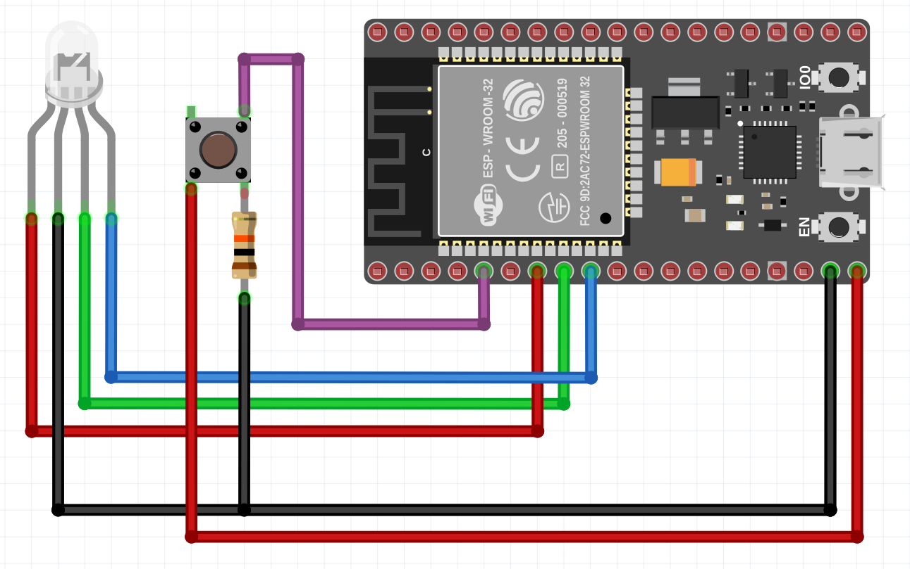

## Entradas e saídas do ESP

> Este é um exemplo básico de como utilizar o framework ESP-IDF para leitura e acionamento de entradas e saídas.

**Com ele é possível realizar:**

- Leitura de uma entrada digital
- Acionamento de uma saída digital

### Circuito utilizado no exemplo

<figure align="center">
   
   <figcaption>Circuito montado para o exemplo.</figcaption>  
</figure>

**Componentes utilizados:**

- [ESP32](https://docs.espressif.com/projects/esp-idf/en/latest/esp32/hw-reference/esp32/get-started-devkitc.html)
- Led RGB
- Push Button
- Resistor 10K

**Conexões:**

| Componente       | Pino do ESP |
| ------------------| ------------- |
| Push Button        | 34                   |
| Led                         | 33                   | 